# IntelliAI ✨
**AI-Powered Story Protocol IP Asset Management Platform**

[](https://intelli-ai-self.vercel.app/)
[](https://storyprotocol.xyz/)
[](https://tomo.inc/)
[](https://debridge.finance/)

> *Transforming intellectual property management through AI-powered insights and blockchain innovation*

---

## 🎯 What is IntelliAI?

IntelliAI is a next-generation platform that revolutionizes how creators and businesses manage intellectual property assets on Story Protocol. By combining advanced AI capabilities with blockchain technology, we provide an intuitive, powerful, and secure environment for IP asset creation, management, and monetization.

### 🌟 Key Value Propositions

- **🤖 AI-First Approach**: Intelligent IP asset creation and management with voice input support
- **🔗 Seamless Integration**: Native Story Protocol integration with real-time blockchain data
- **💼 Multi-Chain Ready**: Powered by Tomo Wallet for universal wallet connectivity
- **🌉 Cross-Chain Bridge**: deBridge integration for seamless token transfers
- **📊 Real-Time Analytics**: Live IP token pricing and comprehensive asset tracking
- **🎙️ Voice Interface**: Hands-free IP management with advanced speech recognition

---

## 🚀 Core Features

### 🤖 AI-Powered IP Assistant
- **Smart Chat Interface**: Natural language interaction for IP asset queries and creation
- **Voice Input Support**: Hands-free operation with `Ctrl+Shift+M` keyboard shortcut
- **Intelligent Responses**: AI-generated insights using Perplexity and Gemini models
- **Auto-Send Voice**: Speech-to-text with automatic message transmission
- **Contextual Understanding**: Wallet-aware responses using connected user data

### 💰 Advanced Analytics Dashboard
- **Real-Time IP Token Pricing**: Live price data from Coinbase API integration
- **Performance Metrics**: Comprehensive tracking of IP asset performance
- **Revenue Analytics**: Minting fees, royalties, and transaction monitoring
- **Interactive Charts**: Responsive data visualization with trend analysis
- **Multi-Chain Data**: Aggregated insights across supported blockchain networks

### 🔗 Story Protocol Integration
- **Native IP Asset Creation**: Streamlined asset registration with metadata management
- **Licensing Management**: Track terms, conditions, and revenue sharing
- **Relationship Mapping**: Visualize IP asset hierarchies and derivatives
- **Real-Time Synchronization**: Live blockchain data from Story Protocol APIs
- **Comprehensive Search**: Advanced filtering and discovery mechanisms

### 💼 Wallet & Bridge Infrastructure

#### Tomo Wallet Integration
- **Universal Compatibility**: Support for 20+ wallets (MetaMask, Rainbow, WalletConnect)
- **One-Click Connection**: Seamless authentication across all networks
- **Multi-Chain Support**: Ethereum, Polygon, Optimism, Arbitrum, Base
- **Social Sign-In**: Walletless authentication with Google, X, and more
- **Enterprise Security**: Non-custodial with industry-standard encryption

#### deBridge Cross-Chain Bridge
- **Story Protocol Optimized**: Native token bridging for IP ecosystem
- **DLN Technology**: Decentralized liquidity network with competitive rates
- **Real-Time Tracking**: Order monitoring with unique IDs and status updates
- **Multi-Chain Coverage**: Bridge between major EVM networks
- **Transparent Fees**: Clear breakdown of protocol and solver costs

---

## 🎙️ Voice Interface Innovation

IntelliAI features cutting-edge voice recognition technology for hands-free IP management:

### Voice Input Capabilities
- **Speech-to-Text**: Advanced recognition with auto-transcription
- **Smart Auto-Send**: Automatic message transmission after speech completion
- **Visual Feedback**: Real-time listening indicators with animated status
- **Keyboard Shortcuts**: `Ctrl+Shift+M` (Windows/Linux) or `Cmd+Shift+M` (Mac)
- **Error Handling**: Graceful fallback with browser compatibility detection

### User Experience
- **Animated Status Indicators**: Pulsing microphone with sound wave effects
- **Contextual Placeholders**: Dynamic input hints based on listening state
- **Accessibility Support**: Full keyboard navigation and screen reader compatibility
- **Mobile Optimized**: Touch-friendly voice activation on all devices

---

## �️ Technical Architecture

### Frontend Stack
```typescript
Next.js 15          // React framework with App Router
React 19            // Latest React with concurrent features
TypeScript          // Type-safe development
Tailwind CSS        // Utility-first styling
Shadcn/UI          // Modern component library
```

### AI & Integration Layer
```typescript
Perplexity AI       // Advanced natural language processing
Gemini AI           // Google's multimodal AI capabilities
Speech Recognition  // Native browser voice input API
Coinbase API        // Real-time cryptocurrency pricing
Story Protocol APIs // Blockchain IP asset data
```

### Blockchain Infrastructure
```typescript
Wagmi + Viem        // Ethereum interaction libraries
Tomo EVM Kit        // Multi-chain wallet connectivity
deBridge SDK        // Cross-chain bridging protocol
Story Protocol SDK  // IP asset management
Web3 Modal          // Wallet connection interface
```

### State Management & Performance
```typescript
React Query         // Data fetching and caching
Zustand            // Lightweight state management
React Hook Form    // Form state and validation
Recharts           // Data visualization
Framer Motion      // Smooth animations
```

---

## 📊 Workflow Diagrams

### 🔄 Complete Platform Architecture


### 🎙️ Voice Input Workflow

```mermaid
sequenceDiagram
    participant U as 👤 User
    participant V as 🎙️ Voice Interface
    participant S as 🎵 Speech Recognition
    participant A as 🤖 AI Engine
    participant B as ⛓️ Blockchain
    participant W as 💼 Wallet
    
    U->>V: Press Ctrl+Shift+M or Click Mic
    V->>S: Activate Speech Recognition
    S->>V: Start Listening (Animated UI)
    U->>S: Speak Command
    S->>V: Convert Speech to Text
    V->>A: Send Text + Wallet Context
    A->>B: Fetch Real-time Data
    A->>W: Get Wallet Address
    A->>V: Return AI Response
    V->>U: Display Results + Auto-send
    
    Note over V: Visual feedback with pulsing mic
    Note over A: Context-aware responses
    Note over W: Non-custodial security
```



### 🎨 IP Asset Creation Flow

```mermaid
flowchart TD
    A[🚀 Start Creation] --> B{💼 Wallet Connected?}
    B -->|No| C[🔐 Connect Wallet via Tomo]
    B -->|Yes| D[🎙️ Voice or Text Input]
    C --> D
    
    D --> E[📝 Asset Name]
    E --> F[📄 Description]
    F --> G[👤 Creator Info]
    G --> H[🖼️ Image Upload]
    H --> I[🔍 AI Validation]
    
    I --> J{✅ Valid Data?}
    J -->|No| K[❌ Show Errors]
    K --> E
    J -->|Yes| L[📡 Submit to Story Protocol]
    
    L --> M[⛓️ Blockchain Transaction]
    M --> N[📋 Metadata to IPFS]
    N --> O[🎉 Success Response]
    
    O --> P[📊 Update Dashboard]
    O --> Q[💰 Track Performance]
    
    style A fill:#4ECDC4
    style O fill:#90EE90
    style K fill:#FFB6C1
    style L fill:#FFD93D
```



### 🌉 Cross-Chain Bridge Workflow

```mermaid
graph LR
    A[💼 User Wallet] --> B[🌉 deBridge Interface]
    B --> C{🔍 Select Networks}
    
    C --> D[📡 Ethereum]
    C --> E[🟣 Polygon]
    C --> F[🔴 Arbitrum]
    C --> G[🔵 Optimism]
    C --> H[📖 Story Protocol]
    
    D --> I[💰 Select Token & Amount]
    E --> I
    F --> I
    G --> I
    H --> I
    
    I --> J[🧮 Calculate Fees]
    J --> K[✅ Confirm Transaction]
    K --> L[⚡ DLN Processing]
    
    L --> M[🔗 Cross-Chain Transfer]
    M --> N[📊 Real-time Tracking]
    N --> O[✅ Completion Notification]
    
    style A fill:#4ECDC4
    style L fill:#8B5CF6
    style O fill:#90EE90
```



### 🤖 AI Processing Pipeline

```mermaid
graph TD
    A[📥 User Query] --> B{🎙️ Voice or Text?}
    B -->|Voice| C[🎵 Speech Recognition]
    B -->|Text| D[📝 Text Input]
    
    C --> E[📄 Transcript Processing]
    D --> E
    E --> F[🧠 Intent Analysis]
    
    F --> G{🎯 Query Type?}
    G -->|General| H[🌐 Perplexity AI]
    G -->|IP Asset| I[⛓️ Story Protocol APIs]
    G -->|Create Asset| J[🎨 Asset Creation Flow]
    
    H --> K[📚 Knowledge Processing]
    I --> L[📊 Blockchain Data]
    J --> M[🔧 Guided Creation]
    
    K --> N[💼 Wallet Context]
    L --> N
    M --> N
    
    N --> O[🎨 Response Generation]
    O --> P[📱 UI Display]
    
    style F fill:#8B5CF6
    style N fill:#FFD93D
    style P fill:#4ECDC4
```



### 📊 Real-Time Data Flow

```mermaid
graph LR
    A[🏗️ Story Protocol] --> B[📡 Story APIs]
    C[💰 Coinbase API] --> D[💱 Price Data]
    E[⛓️ Multi-Chain] --> F[🌉 deBridge APIs]
    
    B --> G[📊 IntelliAI Backend]
    D --> G
    F --> G
    
    G --> H[🎯 Data Processing]
    H --> I[📈 Analytics Engine]
    H --> J[🤖 AI Context]
    H --> K[💼 Wallet Integration]
    
    I --> L[📱 Dashboard UI]
    J --> M[🎙️ AI Responses]
    K --> N[🔐 User Context]
    
    L --> O[👤 User Experience]
    M --> O
    N --> O
    
    style G fill:#FF6B6B
    style H fill:#8B5CF6
    style O fill:#4ECDC4
```



---

## 🌟 User Journey

### 1. **Connect & Authenticate**
- Choose from 20+ supported wallets via Tomo integration
- Automatic network detection and switching
- Secure, non-custodial connection

### 2. **Explore IP Ecosystem**
- Browse Story Protocol IP assets with advanced filtering
- Real-time market data and pricing information
- AI-powered asset recommendations

### 3. **Create IP Assets**
- Voice-guided asset creation process
- Wallet-aware metadata assignment
- Automated blockchain registration

### 4. **Manage & Monitor**
- Track asset performance and royalty streams
- Cross-chain portfolio management
- AI insights for optimization

### 5. **Bridge & Transfer**
- Cross-chain token movements via deBridge
- Real-time transaction tracking
- Transparent fee structure

---

## 🎯 Innovation Highlights

### AI Integration
- **Multi-Model Approach**: Combining Perplexity and Gemini for comprehensive AI capabilities
- **Contextual Intelligence**: Wallet-aware responses with personalized insights
- **Voice-First Design**: Pioneering speech interface for blockchain applications
- **Real-Time Processing**: Instant AI responses with live blockchain data

### Blockchain Innovation
- **Story Protocol Focus**: Purpose-built for IP asset management
- **Multi-Chain Architecture**: Seamless operation across EVM networks
- **Real-Time Synchronization**: Live data feeds from multiple blockchain sources
- **User-Centric Design**: Simplified complexity without sacrificing functionality

### User Experience
- **Zero Learning Curve**: Intuitive interface for both Web3 natives and newcomers
- **Accessibility First**: Voice control, keyboard shortcuts, and screen reader support
- **Performance Optimized**: Sub-second response times with efficient caching
- **Mobile Ready**: Responsive design optimized for all device types

---

## 🚀 Getting Started

### Prerequisites
- Modern web browser (Chrome, Firefox, Safari, Edge)
- EVM-compatible wallet or social login credentials
- Internet connection for real-time data

### Quick Start Guide

1. **Visit [IntelliAI Dashboard](https://intelliai.vercel.app/)**

2. **Connect Your Wallet**
   - Click "Connect Wallet" in the header
   - Choose your preferred wallet or social login
   - Automatic network configuration

3. **Explore AI Chat**
   - Use voice input with `Ctrl+Shift+M`
   - Ask questions about IP assets or Story Protocol
   - Experience real-time AI responses

4. **Create IP Assets**
   - Navigate to AI Chat and say "Create new IP asset"
   - Follow the guided creation process
   - Your connected wallet is automatically linked

5. **Monitor Analytics**
   - View real-time IP token pricing
   - Track your asset performance
   - Access cross-chain insights

---

## 🎉 Hackathon Achievements

### Tomo Wallet Integration Excellence
- ✅ Universal wallet support (20+ wallets)
- ✅ Social authentication integration
- ✅ Multi-chain connectivity
- ✅ Enterprise-grade security
- ✅ Mobile optimization

### deBridge Integration Success
- ✅ Cross-chain token bridging
- ✅ Real-time order tracking
- ✅ Transparent fee structure
- ✅ DLN technology implementation
- ✅ Story Protocol optimization

### Innovation Highlights
- ✅ First AI voice interface for IP management
- ✅ Real-time IP token pricing integration
- ✅ Wallet-aware AI responses
- ✅ Comprehensive Story Protocol integration
- ✅ Professional UX/UI design

---

## 🤝 Contributing

We welcome contributions from the community! Please read our [Contributing Guidelines](CONTRIBUTING.md) and [Code of Conduct](CODE_OF_CONDUCT.md).

### Development Workflow
1. Fork the repository
2. Create a feature branch (`git checkout -b feature/amazing-feature`)
3. Commit your changes (`git commit -m 'Add amazing feature'`)
4. Push to the branch (`git push origin feature/amazing-feature`)
5. Open a Pull Request

---

## 📞 Support & Community

- **Documentation**: [IntelliAI Docs](https://intelliai.vercel.app/docs)
- **Twitter/X**: [@IntelliAI_platform](https://x.com/IntelliAI_platform)
- **Discord**: [Join our community](https://discord.gg/intelliai)
- **Email**: support@intelliai.com

---

## 🙏 Acknowledgments

Special thanks to our technology partners:

- **[Tomo Inc.](https://tomo.inc/)** - Revolutionary multi-chain wallet infrastructure
- **[deBridge](https://debridge.finance/)** - Advanced cross-chain bridging protocol
- **[Story Protocol](https://storyprotocol.xyz/)** - Innovative IP infrastructure
- **[Perplexity AI](https://perplexity.ai/)** - Advanced AI reasoning capabilities
- **[Google Gemini](https://gemini.google.com/)** - Multimodal AI technology

---

## 📄 License

This project is licensed under the MIT License - see the [LICENSE](LICENSE) file for details.

---

## 🚀 Future Roadmap

- [ ] **Mobile Native App** - iOS and Android applications
- [ ] **Advanced AI Models** - Custom IP-focused training
- [ ] **Social Features** - Community IP collaboration
- [ ] **Enterprise Tools** - Business-grade IP management
- [ ] **API Marketplace** - Third-party integrations
- [ ] **Global Localization** - Multi-language support

---

<div align="center">

**Built with ❤️ for the future of intellectual property**

*Empowering creators, protecting innovation, and building the decentralized IP economy*

[🚀 Launch IntelliAI](https://intelliai.vercel.app/) | [📖 Documentation](https://intelliai.vercel.app/docs) | [🐦 Follow Us](https://x.com/IntelliAI_platform)

</div>
```

